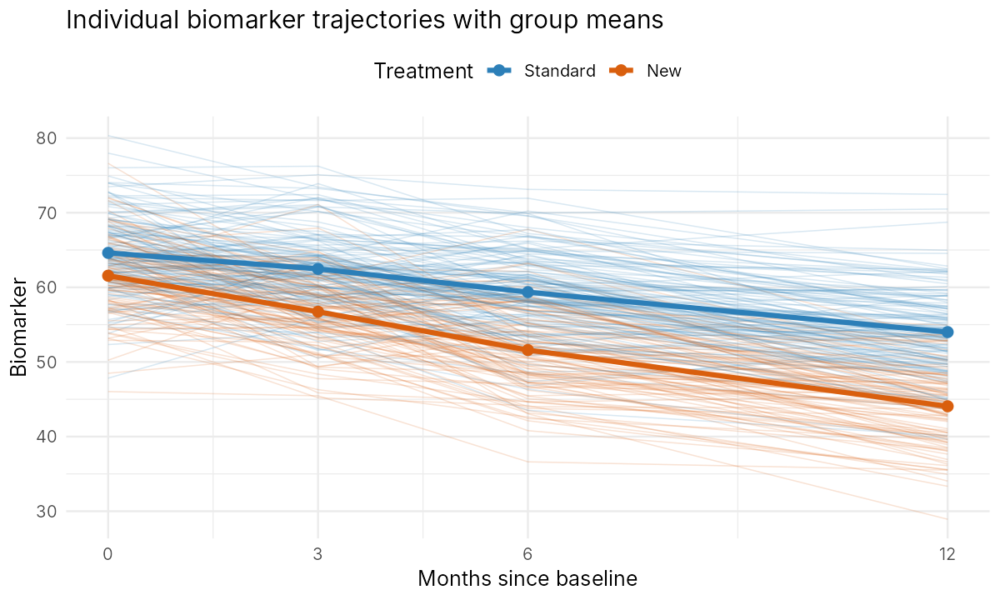
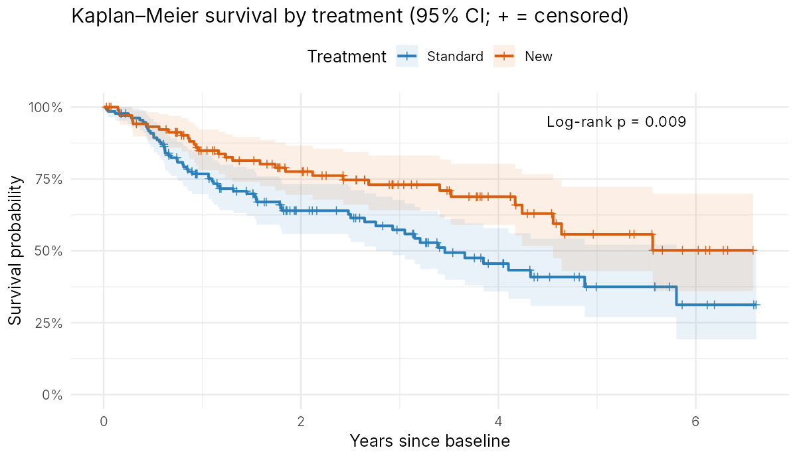

# Longitudinal and Survival Analysis of a Simulated Clinical Follow-up Study

**Tanvir Ahmed** · R · linear mixed models · GEE · Kaplan–Meier · Cox regression

### 📄 [Read the full report →](https://taanvir-ahmed.github.io/longitudinal-survival-analysis/)

The report contains the code, output and interpretation. Its source is [`analysis.Rmd`](analysis.Rmd).

A complete, reproducible analysis of repeated biomarker measurements and time to
death in 240 patients receiving either a standard or a new treatment. I wrote it
as the final project for a university course in *Longitudinal and Survival Data
Analysis* and later revised it into a single reproducible R Markdown report.



## Research questions

1. How does the biomarker change over 12 months, and does the change differ by treatment?
2. How much of the variation is between patients rather than within patients?
3. Does the new treatment improve survival?
4. Is the baseline biomarker prognostic, and does adjusting for it change the treatment effect?

## Key findings

| | Result |
|---|---|
| **Biomarker trend** | Declines by 0.90 units/month under standard treatment and by **1.46 units/month under the new treatment** (interaction −0.56, 95% CI −0.66 to −0.46) |
| **Patient heterogeneity** | ICC = 0.57; patients differ in their *level*, not their *rate* of change (random-slope variance ≈ 0, boundary-corrected LRT p = 0.33) |
| **Mixed model vs GEE** | Identical coefficients when both use the same covariates, as expected for an identity link |
| **Survival** | 3-year survival 73% vs 57%; log-rank p = 0.009 |
| **Cox model** | New treatment **HR 0.56 (95% CI 0.36–0.87)**, adjusted for age and sex; proportional hazards supported |
| **Baseline biomarker** | Weakly prognostic (HR 1.41 per 10 units, 95% CI 0.94–2.10); adjusting for it moves the treatment HR to 0.61 because of a baseline imbalance between groups, not mediation |



## Methods demonstrated

- Wide-to-long restructuring and exploratory longitudinal plots (`tidyverse`)
- Repeated-measures ANOVA with Mauchly's test and Greenhouse–Geisser correction (`afex`, `emmeans`)
- Linear mixed models with random intercepts and slopes, ICC, and REML likelihood-ratio tests with the χ² mixture correction for boundary parameters (`lme4`, `lmerTest`)
- GEE with independence, exchangeable and AR(1) working correlations, plus QIC/CIC (`geepack`)
- Kaplan–Meier estimation, log-rank test, Cox proportional hazards regression and Schoenfeld residual diagnostics (`survival`)
- A discussion of confounding vs mediation, immortal-time bias, and when joint longitudinal–survival models or landmark analysis are needed

## Repository structure

```
├── analysis.Rmd        # the full analysis: code, output and interpretation
├── analysis.R          # the same code as a plain R script
├── docs/index.html     # rendered report (served by GitHub Pages)
├── data/extra_data.txt # simulated dataset (240 patients, wide format)
├── figures/            # figures generated by the analysis
├── renv.lock           # exact package versions used
└── LICENSE
```

## How to reproduce

```r
# 1. Clone the repository and open it in RStudio (or set it as the working directory)
# 2. Restore the package versions used for the analysis
install.packages("renv")
renv::restore()

# 3. Render the report
rmarkdown::render("analysis.Rmd", output_file = "docs/index.html")
```

Built with R 4.3.3. Rendering takes under a minute.

## Data

The dataset is **simulated**; it contains no real patient information.

Variables: `id`, `treatment` (0 = standard, 1 = new), `age`, `sex` (0 = female, 1 = male),
`bio_0`, `bio_3`, `bio_6`, `bio_12` (biomarker at 0/3/6/12 months), `follow`
(survival follow-up in years) and `death` (1 = died, 0 = censored).

## Author

**Tanvir Ahmed**

## License

Code is released under the MIT License (see [`LICENSE`](LICENSE)). The simulated dataset was provided by the course instructor and is shared with their permission.
